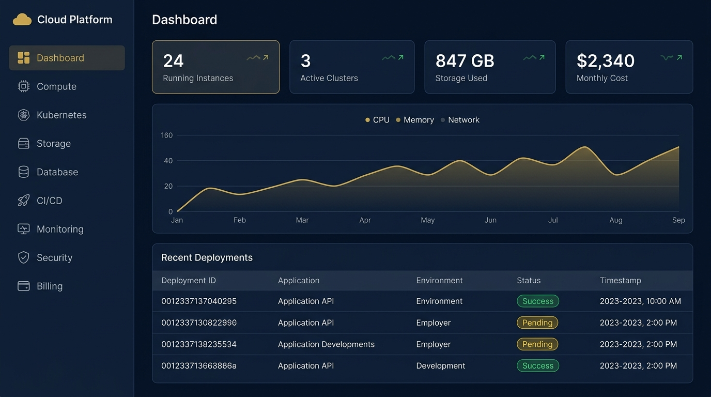

# Aravanta CloudOS

> **An open, self-service cloud operating platform for deploying, managing, and monitoring cloud-native applications and infrastructure.**



---

## 🌟 Vision & Overview

**Aravanta CloudOS** eliminates the fragmentation of modern cloud tooling by acting as a single unified "operating system" for cloud resources — one login, one UI command center, one API surface, with consistent Role-Based Access Control (RBAC) and immutable audit logging across all microservices.

---

## 🛠️ Architecture & Service Catalog

Aravanta CloudOS abstracts cloud infrastructure into 8 native microservices:

| Service | Category | Core Capabilities |
|---|---|---|
| **ArvCompute** | Compute Engine | VMs, auto-scaling groups, spot instances, instance templates, SSH keys |
| **ArvKube** | Kubernetes Engine | Managed K8s clusters, node pools, rolling updates, pod inspector, Helm charts |
| **ArvStore** | Object Storage | High-durability object storage, bucket access policies, versioning, CDN |
| **ArvDB** | Managed Database | Managed PostgreSQL & MySQL, automated HA failover, read replicas, backups |
| **ArvRegistry** | Container Registry | Private Docker registry, automatic CVE scanning, image signing, lifecycle rules |
| **ArvEdge** | Load Balancer & WAF | L7 application load balancing, SSL/TLS termination, rate limiting, DDoS protection |
| **ArvWatch** | Monitoring & Logs | Prometheus metrics, Loki log aggregation, Jaeger tracing, Grafana dashboards |
| **ArvGate** | Identity & Access | JWT auth, MFA (TOTP/FIDO2), RBAC policies, service accounts, audit logs |

---

## 📁 Monorepo Layout

```text
aravanta-cloudos/
├── frontend/             # React 18 + TypeScript + Tailwind CSS web dashboard
├── backend/              # Python 3.11 + FastAPI microservices (ArvGate, ArvCompute, etc.)
├── terraform/            # Infrastructure as Code modules (AWS / Multi-cloud)
├── kubernetes/           # K8s manifests & Helm charts
├── docker/               # Docker Compose for local multi-container development
├── monitoring/           # Prometheus, Grafana, Loki, Alertmanager configs
├── nginx/                # Nginx API Gateway reverse proxy rules
├── scripts/              # Setup, database migration, and seed scripts
└── .github/workflows/    # Continuous Integration & Continuous Deployment workflows
```

---

## 🚀 Quick Start (Local Development)

### Prerequisites
- Docker & Docker Compose
- Python 3.11+
- Node.js 18+

### Running with Docker Compose

```bash
# Clone the repository
git clone https://github.com/aravanta/cloudos.git
cd cloudos

# Start all services (Postgres, Redis, FastAPI Backend, React Frontend, Nginx Gateway)
docker-compose -f docker/docker-compose.yml up -d
```

Access the interfaces:
- **Web Dashboard**: `http://localhost:3000`
- **API Gateway**: `http://localhost:80`
- **FastAPI OpenAPI Docs**: `http://localhost:8000/docs`
- **Grafana Metrics**: `http://localhost:3001`

---

## 📄 Documentation

For full architectural blueprints, security whitepapers, and API specifications, see:
- [HTML Documentation](docs/Aravanta_CloudOS_Documentation.html)
- [Word Document (.docx)](docs/Aravanta_CloudOS_Documentation.docx)

---

## 🛡️ License

Copyright © 2026 Aravanta. All rights reserved.
