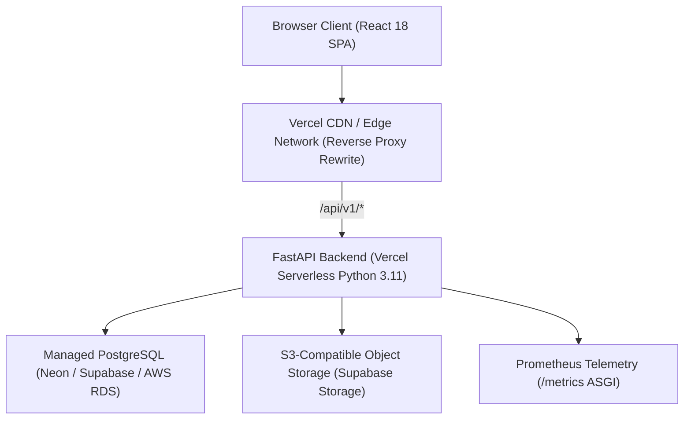

# Aravanta CloudOS

**Self-Service Cloud Operations Platform**

A full-stack cloud operations platform built with React + TypeScript (frontend) and Python FastAPI + SQLAlchemy + PostgreSQL (backend), deployed serverless on Vercel. Designed for infrastructure management, deployment automation, observability, incident response, security governance, and FinOps cost analytics.

| | Link |
|---|---|
| Frontend | https://aravantacos.vercel.app/ |
| Backend API | https://arv-backend.vercel.app/ |
| API Docs (Swagger) | https://arv-backend.vercel.app/docs |

---

## Architecture Overview



> **Note on Infrastructure:** The live platform is deployed serverless on Vercel with PostgreSQL. The `terraform/` and `kubernetes/` directories in this repository represent the **target / reference architecture** for self-hosted or dedicated multi-region deployments.

---

## Tech Stack

| Layer | Technology |
|---|---|
| Frontend | React 18, TypeScript, Vite, TailwindCSS, Recharts, Lucide Icons |
| Backend | Python 3.11+, FastAPI, SQLAlchemy 2.0 (Sync engine + Connection Pooling), Pydantic v2 |
| Database | PostgreSQL (production) / SQLite (`data/` fallback for local dev) |
| Storage | Supabase Storage (S3-compatible object storage) |
| Security & Auth | HS256 JWT, bcrypt password hashing, TOTP MFA, Server-enforced RBAC, Role Hierarchy |
| Deployment | Vercel Serverless (Catch-all proxy rewrite `frontend/vercel.json` → backend ASGI) |
| Telemetry | Prometheus client metrics (`/metrics`), eBPF & Envoy Canary integration stubs |

---

## Security Model & Token Architecture

- **Server-Controlled Authorization:** Roles (`SuperAdmin`, `Admin`, `Operator`, `Developer`, `Viewer`) are exclusively assigned and verified by the server database. Client payloads attempting to supply `role`, `permissions`, or `scopes` are strictly rejected at the schema validation boundary.
- **JWT Storage & XSS Mitigation:** Access tokens are currently stored in `localStorage` for cross-origin proxy ergonomics with Vercel. XSS risk is mitigated through HTTP security headers (`X-Content-Type-Options: nosniff`, `X-Frame-Options: DENY`, `X-XSS-Protection: 1; mode=block`, `Referrer-Policy: strict-origin-when-cross-origin`), output sanitization across user-generated content (community posts/comments), and server-side token revocation tracking.
- **Rate Limiting:** Sliding-window IP and account rate limiting across sensitive endpoints (login, MFA verification, password reset).

---

## Core Cloud OS Services

| Service | Prefix | Purpose |
|---|---|---|
| `arvgate` | `/api/v1/auth` | Identity, authentication, TOTP MFA, workspace RBAC, and audit trails |
| `arvoperations` | `/api/v1/operations` | Applications, deployments, container pods, incident command war room, runbook automations, and backups |
| `arvwatch` | `/api/v1/watch` | Observability, metric timeseries, telemetry, alerts, and live log exploration |
| `arvai` | `/api/v1/ai` | Read-only AI SRE Copilot with mutation guardrails and Root Cause Analysis (RCA) scaffold |
| `arvcompute` | `/api/v1/compute` | Virtual machine instances, rightsizing, and non-prod auto-suspend |
| `arvkube` | `/api/v1/kube` | Managed Kubernetes clusters, node pools, CNI networking, and workload pods |
| `arvstore` | `/api/v1/store` | Object storage buckets, file objects, and predictable egress tracking |
| `arvdb` | `/api/v1/db` | Managed PostgreSQL and Redis database instances with environment-aware sizing |
| `arvedge` | `/api/v1/edge` | Edge routing, custom domains, CDN caching, and SSL certificates |
| `arvcicd` | `/api/v1/cicd` | CI/CD build pipelines, releases, and Envoy canary traffic splitters |
| `arvbilling` | `/api/v1/billing` | Invoicing, payment methods, and usage metering |
| `arvcostiq` | `/api/v1/costiq` | FinOps real-time cost anomaly detection and budget forecasting |
| `arvguard` | `/api/v1/guard` | Cloud compliance scoring (SOC2, ISO27001, HIPAA) and policy enforcement |
| `arvpulse` | `/api/v1/pulse` | Predictive telemetry, systemic health index, and proactive incident forecasting |
| `arvsandbox` | `/api/v1/sandbox` | Ephemeral isolated environments with auto-expiration |
| `arvcommunity` | `/api/v1/community` | Engineering knowledge sharing, architecture posts, and peer discussions |

---

## Local Development Setup

### Prerequisites

- Node.js 18+
- Python 3.11+
- PostgreSQL (or local SQLite auto-fallback)

### Frontend

```bash
cd frontend
npm install
npm run dev
```

Runs on http://localhost:5173

### Backend

```bash
cd backend
python -m venv venv
# Windows:
.\venv\Scripts\activate
# Linux/macOS:
source venv/bin/activate

pip install -r requirements.txt
cp .env.example .env
# Edit .env and set SECRET_KEY (min 32 chars)

uvicorn app.main:app --reload --port 8000
```

Runs on http://localhost:8000

---

## Running the Automated Test Suite

```bash
cd backend
pytest tests -q
```

All security regression tests (P0 authentication bypasses, role hierarchy, rate limiting, and RBAC integrity) are located in `backend/tests/test_p0_regression.py`.

---

## License

MIT

## Author

Yash Baviskar -- yashbaviskar67@gmail.com

GitHub: https://github.com/yashbaviskar15
