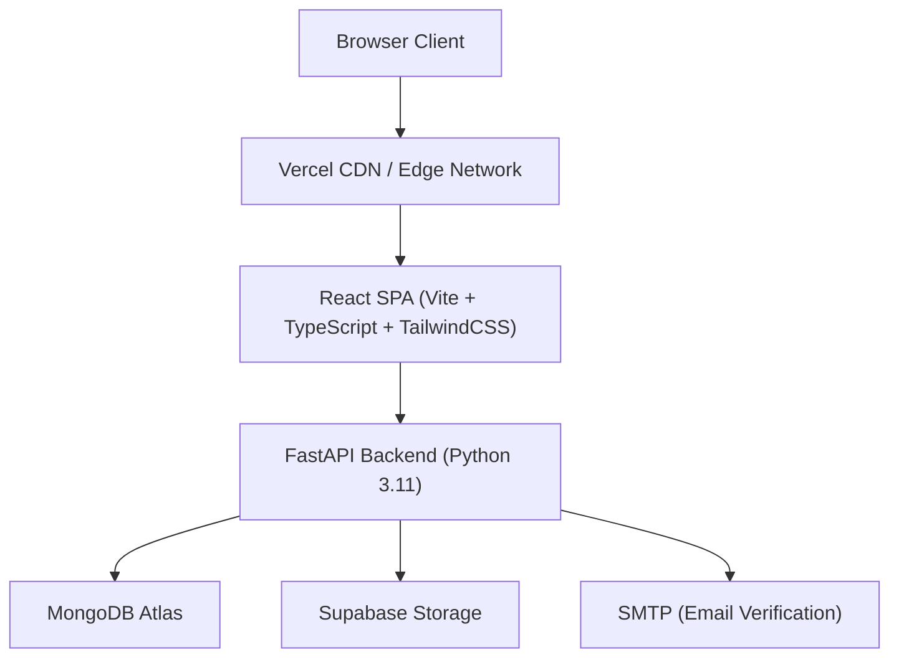

# Aravanta CloudOS

**Self-Service Cloud Operations Platform**

A full-stack cloud operations platform built with React + TypeScript (frontend) and Python FastAPI (backend). Designed for infrastructure management, deployment automation, observability, incident response, security governance, and automation -- simulating a production-grade cloud control plane.

| | Link |
|---|---|
| Frontend | https://aravantacos.vercel.app/ |
| Backend API | https://arv-backend.vercel.app/ |
| API Docs (Swagger) | https://arv-backend.vercel.app/docs |

---

## Architecture Overview



## Tech Stack

| Layer | Technology |
|---|---|
| Frontend | React 18, TypeScript, Vite, TailwindCSS, Recharts, Lucide Icons |
| Backend | Python 3.11, FastAPI, Pydantic, Motor (async MongoDB) |
| Database | MongoDB Atlas (cloud-hosted) |
| Storage | Supabase Storage (S3-compatible object storage) |
| Auth | JWT (HS256), bcrypt password hashing, TOTP MFA |
| Deployment | Vercel (serverless) |
| Email | SMTP (Gmail App Passwords) |

---

## Features

### Operations Console

- **Dashboard** -- Fleet SRE console with live metrics, firing alerts, active incidents, recent deployments
- **Infrastructure** -- Multi-cloud resource inventory with filters, search, and lifecycle actions (restart, stop, decommission)
- **Applications** -- Microservices catalog with scaling slider, deploy, restart, rollback, and 5-tab detail view (Overview, Telemetry, Live Logs, Events, Config)
- **Deployments** -- GitOps pipeline with strategy selection (RollingUpdate / Canary / BlueGreen), execution timeline, and 1-click rollback
- **Containers** -- Kubernetes pod fleet management with CPU/RAM metrics and live log viewer

### Observability

- **Monitoring** -- Multi-series time-series charts (CPU, RAM, Disk I/O), P95 latency distributions, throughput gauges
- **Log Explorer** -- Real-time log stream with severity filters (INFO/WARN/ERROR/DEBUG), service selector, copy, JSON export
- **Alerts** -- Alertmanager triage center with acknowledge, mute (2h), and resolve actions
- **Incidents** -- Incident command center with war-room drawer, status transitions (Detected -> Investigating -> Mitigating -> Resolved), timeline, RCA notes

### Automation and Reliability

- **Automation** -- Self-healing runbooks with "Run Now" triggers and execution history
- **Backups** -- Snapshot disaster recovery inventory with 1-click restore
- **CI/CD** -- Pipeline visualization and container artifact releases

### Cloud Resources

- **Compute** -- Virtual machines (EC2/GCE equivalent)
- **Kubernetes** -- Managed clusters (EKS/GKE equivalent)
- **Databases** -- Managed database engines (Postgres/Redis/MySQL)
- **Object Storage** -- S3-compatible buckets

### Governance

- **Security** -- 4-tier RBAC permission matrix (Admin, Operator, Developer, Viewer) across 6 domains
- **Audit Logs** -- Tamper-evident immutable audit trail with actor, action, resource, IP, and JSON export
- **Billing** -- FinOps cost analytics with INR pricing

### Platform

- Command Palette (Ctrl+K) for quick navigation
- Dark / Light mode
- Responsive design (mobile, tablet, desktop)
- Landing page with pricing, FAQ, and services overview

---

## Local Development Setup

### Prerequisites

- Node.js 18+
- Python 3.11+
- MongoDB Atlas account (or local MongoDB)

### Frontend

```bash
cd frontend
npm install
npm run dev
```

Runs on http://localhost:5173

### Backend

```bash
cd backend
pip install -r requirements.txt
uvicorn app.main:app --reload
```

Runs on http://localhost:8000

### Environment Variables

Backend `.env`:

```
MONGODB_URL=mongodb+srv://...
JWT_SECRET=your-secret-key
SUPABASE_URL=https://xxx.supabase.co
SUPABASE_KEY=your-supabase-key
SMTP_EMAIL=your-email@gmail.com
SMTP_PASSWORD=your-app-password
```

---

## API Endpoints

| Method | Path | Description |
|---|---|---|
| GET | /api/v1/health | Health check |
| POST | /api/v1/auth/register | User registration |
| POST | /api/v1/auth/login | User login (JWT) |
| GET | /api/v1/monitoring/metrics | System metrics |
| GET | /api/v1/monitoring/metrics/timeseries | Time-series telemetry data |
| GET | /api/v1/monitoring/alerts | Active alerts |
| GET | /api/v1/operations/applications | Application catalog |
| GET | /api/v1/operations/deployments | Deployment history |
| GET | /api/v1/operations/containers | Container fleet |
| GET | /api/v1/operations/logs | Log stream |
| GET | /api/v1/operations/incidents | Incident list |
| GET | /api/v1/operations/automation/workflows | Automation runbooks |
| GET | /api/v1/operations/backups | Backup snapshots |
| GET | /api/v1/operations/infrastructure/inventory | Infrastructure inventory |

---

## Project Structure

```
acos/
  frontend/
    src/
      components/       # Reusable UI (Sidebar, Header, StatusBadge, ConfirmModal, CommandPalette)
      pages/            # 20+ operational pages
      config/           # API configuration
  backend/
    app/
      main.py           # FastAPI application entry point
      services/
        arvauth/        # Authentication, registration, JWT, MFA
        arvwatch/       # Monitoring, metrics, alerts, health
        arvoperations/  # Infrastructure, deployments, containers, incidents
        arvcompute/     # Compute VM management
        arvkube/        # Kubernetes cluster management
        arvstore/       # Object storage management
        arvdb/          # Database management
  docs/                 # Architecture and operations documentation
```

---

## License

MIT

## Author

Yash Baviskar -- yashbaviskar67@gmail.com

GitHub: https://github.com/yashbaviskar15
