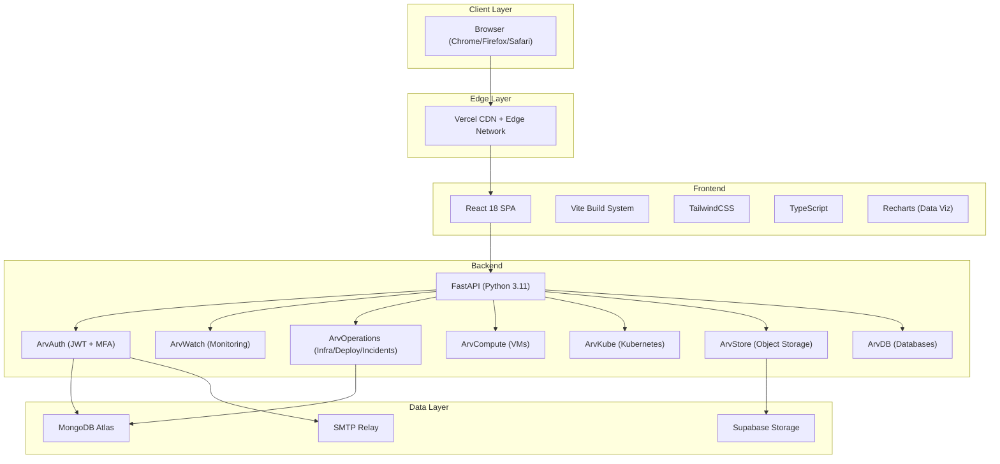
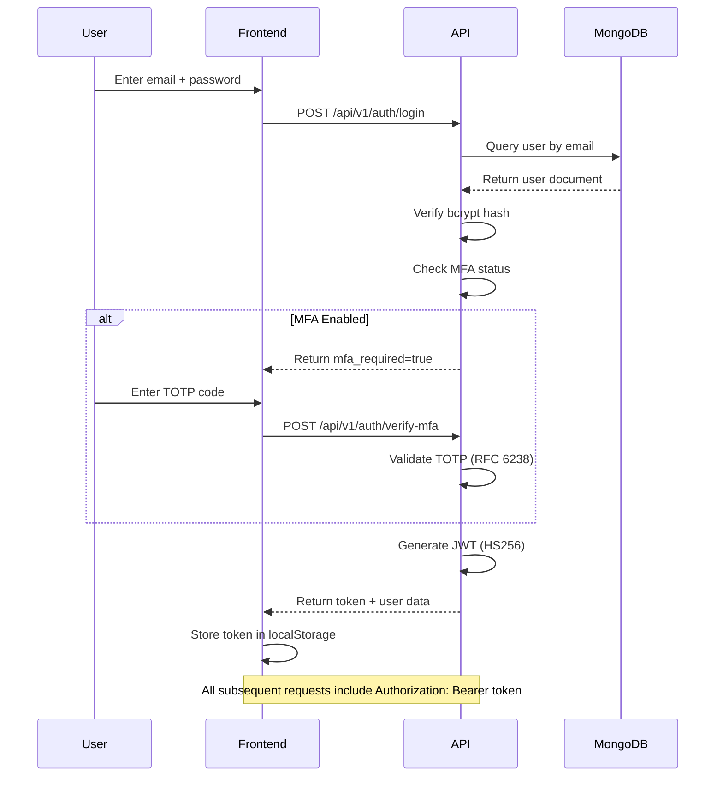

# Architecture Overview

## System Architecture

Aravanta CloudOS follows a standard three-tier web architecture deployed as a serverless application on Vercel.

## Component Breakdown

| Component | Technology | Purpose |
|-----------|-----------|---------|
| Frontend SPA | React 18 + TypeScript + Vite + TailwindCSS | Interactive cloud operations console |
| Backend API | FastAPI + Pydantic + Motor | RESTful API with auto-generated OpenAPI docs |
| Database | MongoDB Atlas | User accounts, audit logs, platform state |
| Object Storage | Supabase Storage | File uploads (S3-compatible) |
| Authentication | JWT (HS256) + bcrypt + TOTP | Stateless auth with multi-factor support |
| Deployment | Vercel (Serverless) | Zero-config CI/CD from Git |

## API Layer Architecture

The backend is organized by service domain, each with its own FastAPI router:

| Router Prefix | Module | Responsibility |
|--------------|--------|---------------|
| /api/v1/auth | arvauth | Registration, login, JWT, MFA, audit logs |
| /api/v1/monitoring | arvwatch | Metrics, time-series, alerts, health checks |
| /api/v1/operations | arvoperations | Infrastructure, deployments, containers, incidents, automation, backups |
| /api/v1/compute | arvcompute | Virtual machine lifecycle |
| /api/v1/kubernetes | arvkube | Kubernetes cluster management |
| /api/v1/storage | arvstore | Object storage bucket operations |
| /api/v1/databases | arvdb | Managed database engines |

## Authentication Flow

