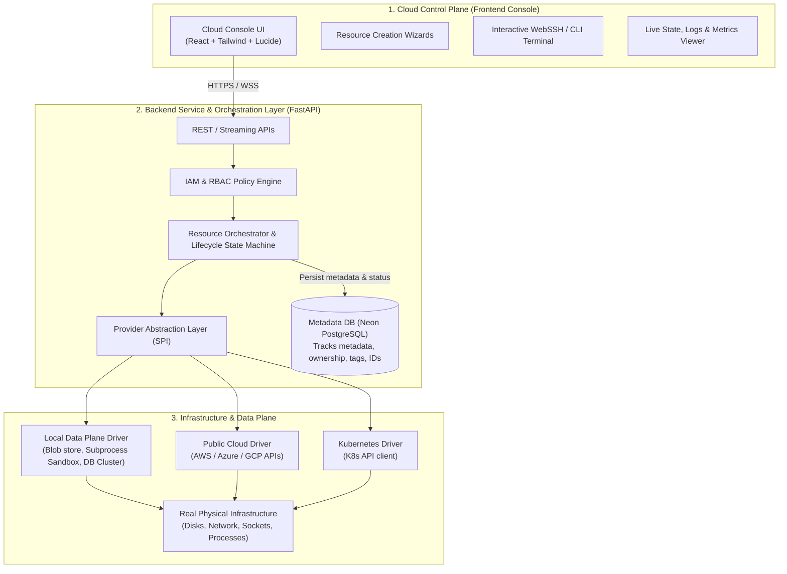

# Aravanta Cloud OS: 3-Tier Cloud Control Plane Architecture & Audit

## 1. Executive Assessment & Architectural Audit

The objective is clear: **Aravanta Cloud OS must operate as a genuine cloud platform experience**, comparable in architectural discipline to AWS, Azure, and Google Cloud Platform. 

A database table row is **metadata**, not the resource itself. A cloud resource only exists when its underlying infrastructure layer (compute runtime, storage medium, database daemon, network device, event broker) has actually provisioned it and is ready for real operations.

### Current Codebase Audit

| Service Domain | Current State | Underlying Infrastructure Dependency | Real vs Fake Status | Required Transformation |
| :--- | :--- | :--- | :--- | :--- |
| **Compute (`ArvCompute`)** | Random IP generators (`10.x.x.x`), instant fake `"RUNNING"` state, table rows | Cloud Hypervisor / Cloud Provider API (AWS EC2 / GCP GCE / Azure VM) OR Local Container Runtime (Docker Engine) | **Simulated** | Implement **Provider Abstraction Layer** (`IComputeProvider`). Support Docker Engine / KVM or AWS/GCP APIs. State must be `PENDING_CONFIG` or `AWAITING_PROVIDER` if no driver is configured. Real WebSSH/Terminal connection. |
| **Object Storage (`ArvStore`)** | Bucket records created; uploads read file size but discard bytes; downloads stream fake text | Filesystem Blob Store (`/data/storage`), S3-compatible backend (MinIO / AWS S3 / Cloudflare R2) | **Partially Simulated** | **Implement Real Storage Data Plane**: Persist real binary content with real SHA-256 ETags. Real downloads stream exact uploaded bytes. Real multipart chunking. |
| **Databases (`ArvDB`)** | Records in DB, fake `.internal.aravanta.cloud` endpoint | PostgreSQL Engine (Neon pooled instance or local daemon), MySQL/Redis containers | **Simulated** | **Implement Real Database Engine**: Leverage connected PostgreSQL cluster to execute real `CREATE DATABASE` / `CREATE USER` commands with isolated roles and connection strings that users can actually connect to via `psql`. |
| **Serverless (`ArvFunctions`)** | Records in DB, `random.randint` duration/memory | Subprocess / Container Isolation Runner (Python sandbox) or AWS Lambda / Cloudflare Workers | **Simulated** | **Implement Real Sandboxed Execution**: Execute user code with `asyncio` subprocess runner, capturing actual `stdout`, `stderr`, real execution time (nanoseconds), and real return payloads. |
| **Vault / KMS (`ArvVault`)** | Table rows with AES strings | Cryptographic Hardware / OS entropy (`cryptography` library AES-GCM / RSA-4096 / Ed25519) | **REAL CRYPTO** | Back with authentic **AES-256-GCM** encryption/decryption engine, real RSA key generation, and cryptographic signing/verification. |
| **Event Bus (`ArvEvents`)** | Table rows in PostgreSQL | Real Queue Engine (Redis or PostgreSQL transactional queue with advisory locks) | **Simulated** | **Implement Real Queue Data Plane**: Real FIFO/Standard queue leasing with visibility timeouts, real polling, dead-letter dispatch, and event rule pattern matching. |
| **IAM (`ArvGate`)** | Real PostgreSQL records, real bcrypt, real JWT, real TOTP MFA | Operating System / PostgreSQL / Cryptographic RNG | **REAL** | Already real. Expand with fine-grained policy evaluation engine (Allow/Deny statements) modeled on AWS IAM policies. |
| **DNS (`ArvDNS`)** | Zone/Record table rows | Authoritative DNS server / Route53 / Cloudflare API or system resolver | **Simulated** | Provide live DNS resolution probes (`socket.getaddrinfo`), authoritative NS delegation verification, and Cloudflare/Route53 driver integration. |
| **Monitoring (`ArvWatch`)** | Prometheus client (`/metrics`) | Real Host Telemetry / Prometheus Collector / OpenTelemetry | **Partially Real** | Only show real host metrics collected from the system/environment. Never emit randomized CPU/RAM waveforms. Show `NO_METRIC_DATA` when an agent is not attached. |

---

## 2. The 3-Tier Cloud Architecture Standard

Every service across Aravanta Cloud OS must strictly adhere to the 3-tier boundary:

### Core Architecture Rules

1. **The Database is a State Registry, NOT the Resource**:
   - The database stores `resource_id`, `provider_resource_id`, `owner_id`, `config`, `created_at`.
   - The status in the database is synchronized from the real infrastructure driver (e.g. `PROVISIONING` -> `ACTIVE` or `FAILED`).
2. **Zero Fake Metrics & Zero Fake IPs**:
   - If a resource cannot be provisioned due to missing provider credentials (e.g. AWS credentials not supplied), the status must explicitly display:
     `STATUS: CONFIGURATION_REQUIRED (Provider credentials not configured)`
   - Never generate random IPs (`10.x.x.x`) or randomized latency graphs.
3. **Real In-Process / Local Data Plane for Standalone Deployment**:
   - For services that can be powered natively (Object Storage, KMS/Vault, Serverless Functions, Event Queues, Managed Tenant Databases on PostgreSQL), we provide **fully functional real implementations** that run without needing a 3rd-party billable AWS account!
   - For heavy hypervisor services (VMs, VPCs), we provide the provider abstraction with:
     - Cloud Driver (AWS EC2 / GCP Compute)
     - Local Container Driver (Docker / Process sandbox)
     - Transparent Provider Status reporting when no credentials are configured.
