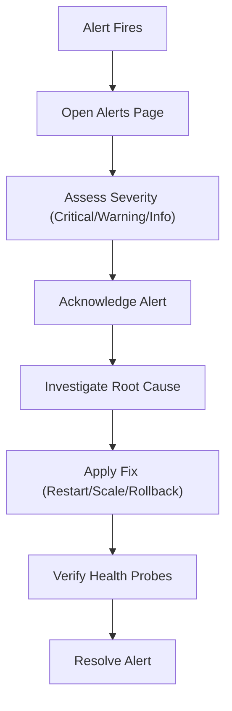

# Operations Runbook

Standard operating procedures for managing the Aravanta CloudOS platform.

## Monitoring the Platform

1. Navigate to **Dashboard** for a fleet-level overview of system health
2. Check the KPI cards: Total Services, Healthy Count, Firing Alerts, Active Incidents
3. Review the time-series charts for CPU/RAM trends over the last 24 hours
4. Check the **Monitoring** page for detailed telemetry with configurable time ranges (5m to 7d)
5. Verify SLO compliance on the **Settings** page: availability (99.95%), P95 latency (<200ms), error rate (<0.1%)

## Responding to Alerts

1. Navigate to **Alerts** page
2. Filter by severity (Critical first)
3. Click **Ack** to acknowledge and assign to on-call
4. Investigate using **Log Explorer** and **Monitoring** pages
5. Apply remediation (restart service, scale replicas, rollback deployment)
6. Click **Resolve** once the underlying issue is fixed
7. Use **Mute** (2h) for known non-actionable alerts during maintenance

## Handling Incidents

1. Navigate to **Incidents** page
2. Transition status: Detected -> Investigating -> Mitigating -> Resolved
3. Open the war-room drawer to view the full event timeline
4. Post updates with timestamps to the timeline
5. After resolution, document the Root Cause Analysis (RCA)
6. Review MTTR metrics on the dashboard

## Deploying New Versions

1. Navigate to **Applications** page
2. Select the target service
3. Click **Deploy** to open the deployment modal
4. Enter the target version tag (e.g., v2.5.0)
5. Select deployment strategy:
   - **RollingUpdate**: Zero-downtime sequential pod replacement
   - **Canary**: 25% traffic shift with health gate verification
   - **BlueGreen**: Instant cutover with standby environment
6. Click **Trigger Rollout**
7. Monitor the deployment on the **Deployments** page
8. If health probes fail, use **1-click Rollback** to revert

## Managing Infrastructure

1. Navigate to **Infrastructure** page
2. Filter by environment, resource type, or status
3. Search by name, region, or tag
4. Available lifecycle actions:
   - **Rolling Restart**: Zero-downtime restart with health probe verification
   - **Stop**: Halt runtime execution (use with caution in production)
   - **Decommission**: Permanent teardown (requires confirmation)
5. Click any resource row to open the inspection drawer with full details

## Managing Backups

1. Navigate to **Backups** page
2. Review snapshot inventory with retention status
3. Verify backup integrity via the status column
4. To restore: click **Restore** on the target snapshot
5. Confirm the restore action in the confirmation modal
6. Monitor restore progress

## Running Automation Runbooks

1. Navigate to **Automation** page
2. Review available runbooks and their execution step sequences
3. Click **Run Now** to trigger immediate execution
4. Confirm in the confirmation modal
5. Monitor execution status and duration
6. Review execution history for past runs
